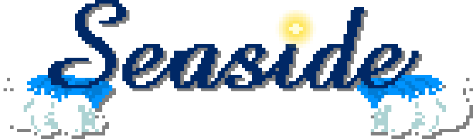

  

---

Seaside is a static website displaying an animated pixel art canvas, built with [PixiJS](https://github.com/pixijs/pixijs).

It follows a day-night cycle according to user's current time.
The sun and moon are indicators of the current time.
The sun rises at 6:00 and sets at 18:00, and vice versa for the moon.
